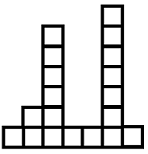

# M. Fence

Polycarpus has a fence in front of his home. The fence consists of n planks of equal width placed consecutively from left to right. The height of the i-th plank is hᵢ meters, and different planks may have different heights.

Polycarpus has bought a posh piano and wants to carry it into the house. To make a hole wide enough, he needs to remove **exactly** k consecutive planks from the fence. Since higher planks are harder to tear off, he wants to choose the segment of k consecutive planks whose total height is as small as possible.

Your task is to find the starting index of such a segment.

---

## Input

- The first line contains two integers n and k  
  (1 ≤ n ≤ 1.5·10⁵, 1 ≤ k ≤ n) –  
  the number of planks and the required width (in planks) of the hole.
- The second line contains n integers h₁, h₂, ..., hₙ  
  (1 ≤ hᵢ ≤ 100), where hᵢ is the height of the i-th plank.

---

## Output

Print a single integer j — the **1-based** index of the first plank in a segment of length k with the minimum possible total height.  
If there are multiple valid answers, output any of them.

---

## Example

**Input**

7 3
1 2 6 1 1 7 1

**Output**

3
